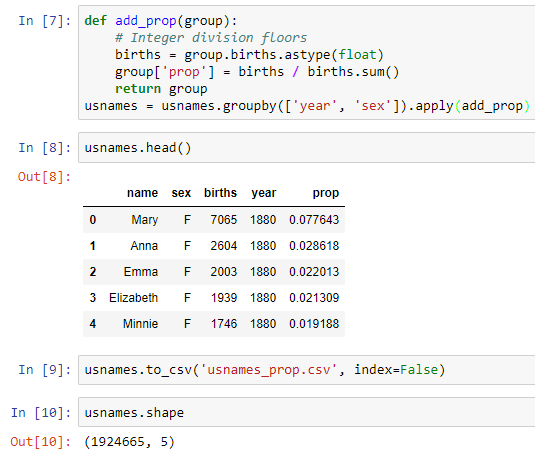

US Baby names (1880-2017)

filename: usnames.zip  
format: ZIP archive (CSV)   
source: https://www.ssa.gov/oact/babynames/background.html  
date updated: 2020-07-24

NOTE: [pandas.read_csv()](https://pandas.pydata.org/pandas-docs/stable/reference/api/pandas.read_csv.html) will work on the URL to the zip file.

This example uses the US Baby Names dataset (http://www.ssa.gov/oact/babynames/limits.html) that has male and female names with the corresponding number of social security registrations for each year from 1880 to 2017. You can see examples of using it for learning analysis in the Python for Data Analysis book by Wes McKinney (O'Reilly, 2012).

The data set has some interesting properties. A good exploration can be found at http://www.prooffreader.com/2014/07/graphing-problematic-aspects-of-us-baby.html.

I've combined all the individual files for each year added the yearly proportion column for each name.

